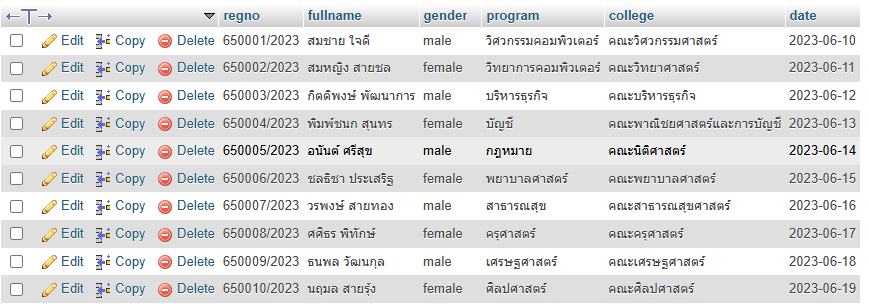

# StudentRecord – Android CRUD App Use PHP Backend

## Overview

StudentRecord is an Android application built with **Java, Volley, PHP, and MySQL**.

It demonstrates full **CRUD operations** (Create, Read, Update, Delete) for managing student records.

Users can add, edit, delete, and view student data. The app also provides a date picker for selecting a pickup date.

---

## Features

- Display student list using RecyclerView
- Create new student record
- Edit existing record
- Delete record
- Select pickup date via Material Date Picker
- Connects to backend PHP REST API with MySQL database

---

## Screenshot


## Project Structure

```
StudentRecord/
│
├── app/src/main/java/com/example/studentrecord/
│   ├── MainActivity.java       # Main screen logic
│   ├── Student.java            # Data model
│   ├── StudentAdapter.java     # RecyclerView adapter
│   ├── VolleySingleton.java    # RequestQueue manager
│   ├── Api.java                # API endpoint configuration
│
├── app/src/main/res/layout/
│   ├── activity_main.xml       # Main activity layout
│   ├── dialog_add_edit.xml     # Add/Edit dialog layout
│   ├── item_student.xml        # RecyclerView item layout
│
├── php-api/
│   ├── db.php                  # Database connection
│   ├── students_list.php       # Read
│   ├── students_create.php     # Create
│   ├── students_update.php     # Update
│   ├── students_delete.php     # Delete
│
└── README.md

```

---

## Tech Stack

- Android (Java 11)
- Volley for REST API requests
- PHP 7/8 for API
- MySQL as database

---

## Setup

1. Clone the project and open with Android Studio
2. Ensure `gradle/libs.versions.toml` includes dependencies:
    
    ```toml
    volley = { module = "com.android.volley:volley", version = "1.2.1" }
    material = { module = "com.google.android.material:material", version = "1.12.0" }
    
    ```
    
3. Create MySQL database:
    
    ```sql
    CREATE DATABASE allstudents CHARACTER SET utf8mb4 COLLATE utf8mb4_unicode_ci;
    USE allstudents;
    CREATE TABLE students (
      regno VARCHAR(64) PRIMARY KEY,
      fullname VARCHAR(128),
      gender VARCHAR(16),
      program VARCHAR(64),
      college VARCHAR(128),
      date DATE
    );
    
    ```

    
    
4. Place PHP files (`php-api/`) in your server (e.g., XAMPP/Apache `htdocs/studentrecord/api/`)
5. Update API base URL in `Api.java`:
    
    ```java
    public class Api {
        public static final String BASE = "http://<your-ip>/studentrecord/api/";
        public static final String LIST = BASE + "students_list.php";
        public static final String CREATE = BASE + "students_create.php";
        public static final String UPDATE = BASE + "students_update.php";
        public static final String DELETE = BASE + "students_delete.php";
    }
    
    ```